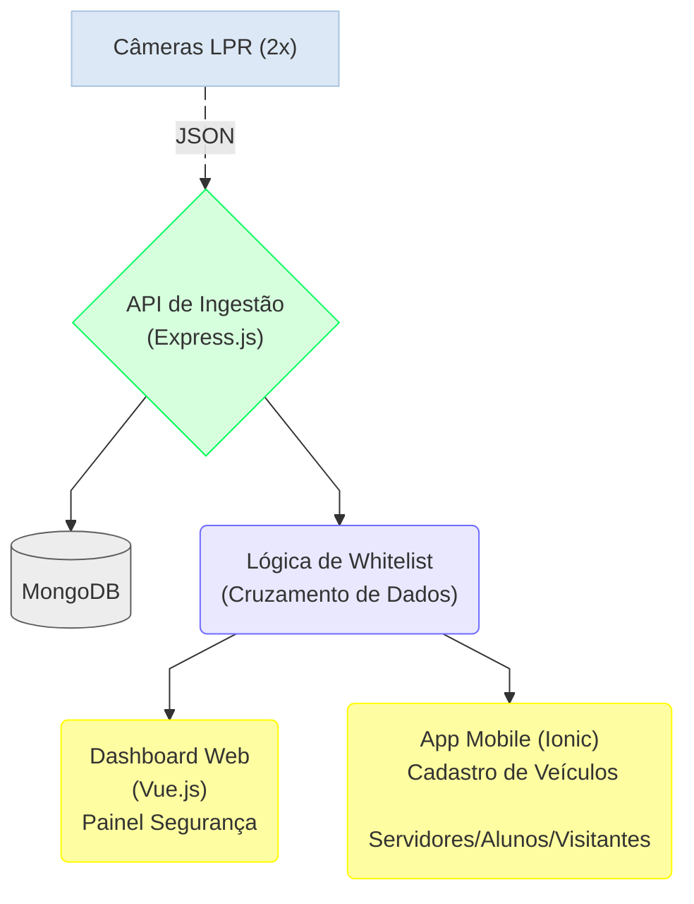
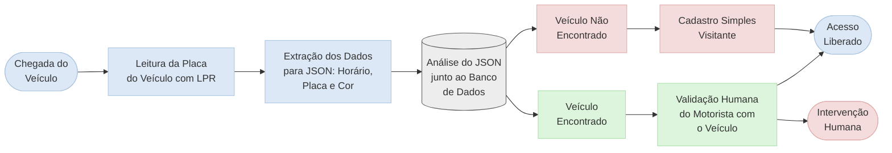
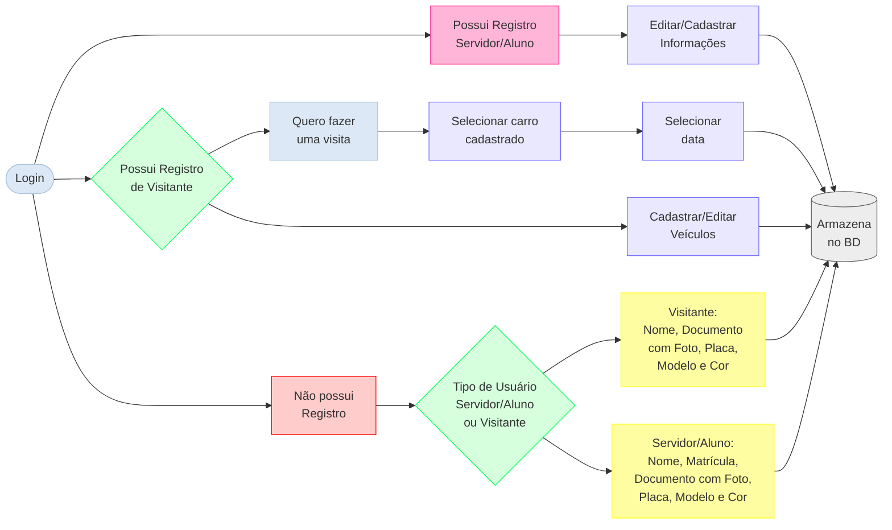

 
 

# CARCARÁ SENTINELA

### Sistema de Autenticação e Controle de Acesso de Veículos em Instituições Federais de Ensino

---

## Problema

Institutos Federais de Ensino são ambientes com grande e constante circulação de pessoas, estudantes, servidores e visitantes, o que os torna vulneráveis quando não há monitoramento adequado. Em instituições que atendem alunos menores de idade, essa vulnerabilidade é ainda mais crítica.

O cenário brasileiro de insegurança agrava esse quadro: ambientes educacionais não estão imunes à violência urbana, e muitas instituições não dispõem de recursos suficientes para garantir a proteção necessária. O modelo tradicional de segurança, baseado em intervenções manuais na guarita, é suscetível a falhas humanas, não gera registros confiáveis e não oferece suporte à tomada de decisão em tempo real.

Sabe-se que conhecer o fluxo de acesso ao ambiente estudantil é primordial para uma cultura de segurança preventiva, e é exatamente essa lacuna que o projeto busca endereçar.

---

## Proposta

O **Carcará Sentinela** propõe um ecossistema de software integrado às câmeras LPR já existentes no campus, capaz de identificar automaticamente veículos cadastrados, alertar sobre acessos não reconhecidos e fornecer um painel de controle em tempo real para a equipe de segurança.

A solução é desenvolvida em **código aberto**, focada no cadastramento de servidores, alunos e visitantes, e gerenciada pelo próprio setor responsável da instituição. Indo além de uma barreira física, o sistema atua na **prevenção de incidentes** e no **controle de acessos indevidos**, gerando registros ágeis que promovem transparência para gestores, alunos e visitantes, sem restringir o caráter público da instituição.

---

## Objetivos

- Monitorar o fluxo de acesso veicular no campus em tempo real
- Automatizar a identificação de veículos cadastrados via lógica de **Whitelist**
- Fornecer um painel de controle para a equipe de segurança
- Reduzir a dependência de intervenções manuais na guarita
- Garantir transparência e rastreabilidade dos registros de acesso

---

## Stack Tecnológica

| Camada | Tecnologia |
|---|---|
| Linguagem base | JavaScript / TypeScript |
| Servidor / API | Node.js + Express.js |
| Frontend Web | Vue.js |
| Aplicativo Mobile | Ionic + Vue |
| Banco de Dados | MongoDB |
| Aquisição de dados | Câmeras LPR (infraestrutura existente) |

---

## Arquitetura do Sistema

## Fluxo de Acesso Veicular
 

 
## Fluxo do Aplicativo Mobile
 

---

## Etapas de Desenvolvimento

**a) Ingestão de Dados** — Integração com a API das câmeras LPR para recebimento de metadados em formato JSON

**b) Persistência** — Modelagem do banco de dados para registro histórico dos fluxos de acesso

**c) Módulo de Cadastro** — Interface para registro e gerenciamento de veículos de servidores, alunos e visitantes

**d) Inteligência de Cruzamento** — Implementação da lógica de Whitelist para identificação automática de usuários cadastrados

**e) Interface de Validação** — Painel de controle em tempo real para suporte à decisão da equipe de segurança

**f) Homologação** — Testes de campo na guarita do campus para validar latência e acurácia do sistema

---

## Métricas de Avaliação

A eficácia do sistema será medida pela comparação entre:

- Placas com **correspondência imediata** no banco de dados (identificação automática)
- Placas que **exigiram intervenção manual** do segurança por ausência de cadastro

---

## Equipe

| Nome | Papel |
|---|---|
| Hygor Marques | Aluno pesquisador |
| Iarla Brito | Aluna pesquisadora |
| Isadora Cozendey | Aluna pesquisadora |
| Tiago Heineck | Professor orientador |
| Tiago Gonçalves | Professor orientador |
| Fabricio Bizzoto | Professor orientador |

> Instituto Federal Catarinense — Campus Videira/SC
> Curso Bacharelado em Ciência da Computação

---

## Cronograma

| Atividade | Fev | Mar | Abr | Mai | Jun |
|---|:---:|:---:|:---:|:---:|:---:|
| Definição do tema do projeto | ✅ | | | | |
| Definição de requisitos e estudo do padrão JSON das câmeras LPR | | ✅ | | | |
| Levantamento de referências | | ✅ | | | |
| Escolha das tecnologias | | ✅ | | | |
| Planejamento dos procedimentos e testes | | ✅ | | | |
| Modelagem do Banco de Dados e Setup do Ambiente | | | ✅ | | |
| Desenvolvimento da API de Ingestão | | | ✅ | ✅ | |
| Desenvolvimento do App de Cadastro | | | ✅ | ✅ | |
| Desenvolvimento do Dashboard do Segurança | | | | ✅ | ✅ |
| Testes de Integração e Homologação na Guarita | | | | | ✅ |
| Finalização do Relatório Técnico e Apresentação | | | | | ✅ |

---

## Referências

- CASTRO, J. P. *Segurança universitária: um desafio em tempos de insegurança.* Integração Multidisciplinar, Cap. 5. DOI: 10.63330/aurumpub.006-005
- STELZER, J. et al. *Segurança nas instituições federais de ensino: estudo de caso do IFSC Araranguá.* XVI CIGU, Arequipa, 2016.
- FERREIRA JUNIOR, A. et al. *Avanços e desafios na segurança universitária: um estudo na UFV.* Contribuciones a Las Ciencias Sociales, v. 18, n. 4, 2025.
- ANDRADE FILHO, O. E. *Violência urbana: uma análise do fenômeno na UFPB (Campus I).* Dissertação de Mestrado, UFPB, 2021.

---

Desenvolvido com 💚 no **IFC Videira/SC** — 2026

